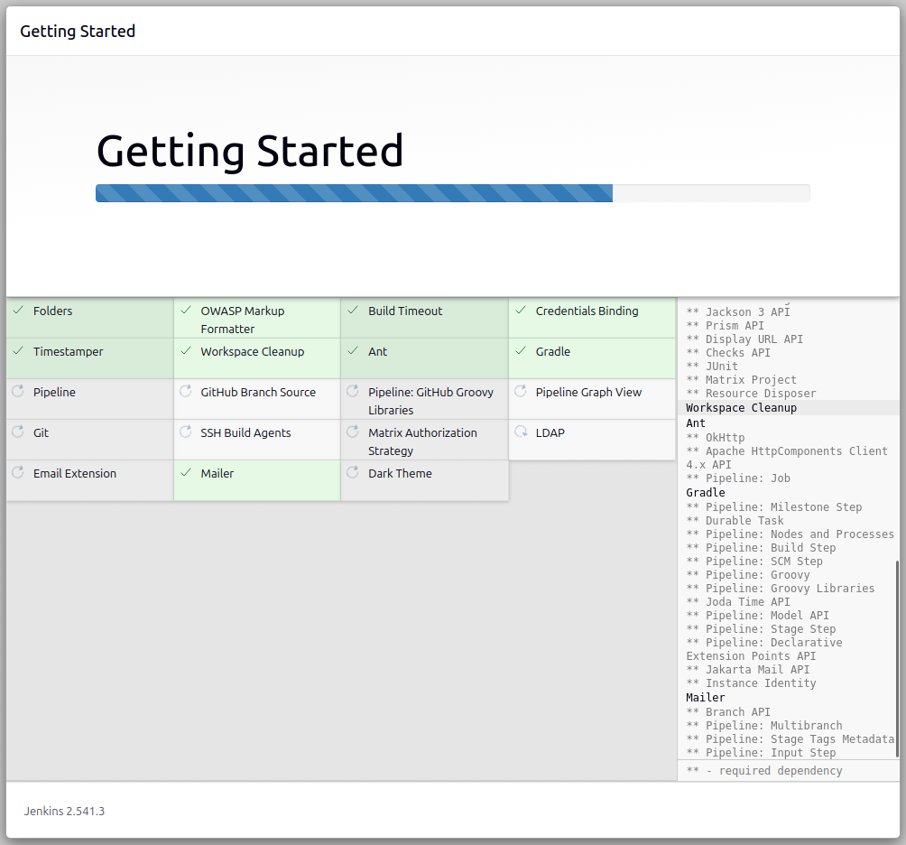

# Overview

This project implements a simple web application based on a client–server architecture.

- The **client** provides user interfaces for registration and login.
- The **server** exposes RESTful APIs to handle user requests and authentication logic.
- The **database** stores user information.

Technologies Used

- **Frontend:** HTML, JavaScript
- **Backend:** Node.js, Express
- **Database:** MongoDB, Mongoose
- **Containerization:** Docker
- **Orchestration:** Docker Compose
- **CI/CD:** GitHub Actions

# Web-app structure
```
my-web-app/
│
├── server/
│   ├── package.json
│   ├── package-lock.json
│   ├── server.js
│   ├── models/User.js
│   └── config/db.js
│
├── client/
│   ├── index.html
│   ├── login.html
│   ├── register.html
│   └── script.js
```

# Docker
Install Docker
```
sudo apt install docker.io -y
docker --version
```
Install Docker Compose  
1. To download and install the Docker Compose CLI plugin, run
```
DOCKER_CONFIG=${DOCKER_CONFIG:-$HOME/.docker}
mkdir -p $DOCKER_CONFIG/cli-plugins
curl -SL https://github.com/docker/compose/releases/download/v5.0.1/docker-compose-linux-x86_64 -o $DOCKER_CONFIG/cli-plugins/docker-compose
```
2. Apply executable permissions to the binary
```
chmod +x $DOCKER_CONFIG/cli-plugins/docker-compose
```
3. Test the installation
```
docker compose version
```
In docker-compose.yml, declare username and password so that the container will be automatically initialized when run
```
MONGO_INITDB_ROOT_USERNAME: <username>
MONGO_INITDB_ROOT_PASSWORD: <password>
```
And of course, the db.js file must also contain the same username and password 
```
await mongoose.connect("mongodb://<username>:<password>@mongo:27017/web-app?authSource=admin>
```
Finally, at the folder having docker-compose.yml, run
```
docker compose up --build
```
After run the container, use following to access the mongdoDB
```
docker exec -it mongo mongosh -u <username> -p <password> --authenticationDatabase admin
```

# Prepare the target cluster (K3s cluster)
Install K3s cluster by following the steps at
```
https://docs.k3s.io/quick-start
```
After install K3s cluster, use following command to check cluster's status
```
sudo kubectl get nodes
```
It will return the result
```
NAME     STATUS   ROLES           AGE     VERSION
ubuntu   Ready    control-plane   3h11m   v1.34.6+k3s1
ubuntu1  Ready    <none>          3h10m   v1.34.6+k3s1
ubuntu2  Ready    <none>          3h10m   v1.34.6+k3s1
```
# Install Jenkins
Visit the following website to install
```
https://www.jenkins.io/doc/book/installing/linux/
```
Make sure that Jenkins is started
```
sudo systemctl enable jenkins
sudo systemctl start jenkins 
sudo systemctl status jenkins
```
Take admin password
```
sudo cat /var/lib/jenkins/secrets/initialAdminPassword
```
Copy and paste it in website for required authentication as admin
```
http://localhost:8080
```
Next, you need to complete a few setup steps before moving on to pipeline configuration.
  

After completing the installation steps, proceed to create the pipeline
```
Jenkins Dashboard → New Item → Pipeline
       ↓
Definition: Pipeline script from SCM
SCM: Git
Repository URL: git@github.com:username/repo.git
Credentials: <SSH key between Jenkins and Github>
Branch: main (or can be another branch)
Script Path: Jenkinsfile (default)
```
# Pipeline
```mermaid
flowchart TD
    A[Developer pushes code to GitHub] --> B[Jenkins CI/CD]

    B --> C[Build Docker images for Server & Client]
    C --> D[Push images to Docker Hub]

    D --> E{Deployment target?}

    E -->|Single server| F[Server with Docker & Docker Compose]
    F --> G[Pull images from Docker Hub]
    G --> H[Run containers using docker-compose.yml]

    E -->|K3s cluster| I[K3s nodes]
    I --> J[Pull images from Docker Hub]
    J --> K[Apply Kubernetes YAML: Deployment + Service + Ingress]
    K --> L[Pods running & exposed via Ingress]

